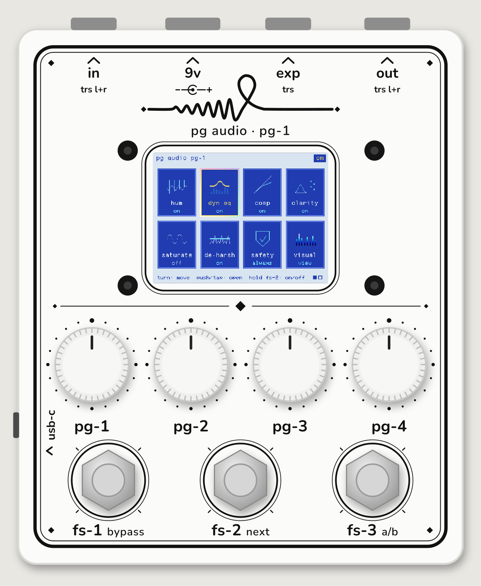

# PG-1: pg audio programmable stereo pedal (Daisy Seed3)

## Order it (3 steps)
1. **Parts:** upload `02-Parts-and-Cart/tayda-cart-import.csv` on the Tayda cart page (Import → Add from file → Replace current cart).
   Buy the Seed3, the SparkFun CAB-15455 USB-C panel cable, a 9V adapter, VHB foam tape and solder separately (`02-Parts-and-Cart/BOM.md`).
2. **Drilled box + printed top:** run `python3 ../_Tools/tayda_upload.py`. It logs in to your drill.taydakits.com account and creates
   the drill template (16 holes + screen window + USB-C slot) and the UV print template for you. Then check both previews on the dashboard and create the order there.
   (By hand instead: `03-Drill-Template/DRILL-ORDER.md` + `04-Top-Artwork/UV-PRINT.md`.)

## Build it
`05-Wiring-and-Schematics/WIRING.md` has one table: every wire from each part to its Seed3 pin. It also shows how the Seed3 is mounted and covers the first flash.
`06-Firmware-DaisySeed/pg1.bin` is ready to flash: a stereo delay with auto-leveling that uses every control.

Using it with your Fifine SC3 (line out → pedal → headset): `USING-WITH-FIFINE-SC3.md`.

## Try it on your PC first
`10-Carla-Plugin/` is the PG-1 as a VST3 for Carla (and a standalone app): a 3D pedal with the **same screen, knobs, touch and sound** as the real one, because both run the same core code. Installed at `~/.vst3/PG-1 Pedal.vst3`.

## Folders
| Folder | What's inside |
|---|---|
| 01-Questions-and-Specs | final spec + your answers |
| 02-Parts-and-Cart | Tayda import CSV, full BOM with prices |
| 03-Drill-Template | drill.taydakits.com entry sheet, CSV, 1:1 paper template |
| 04-Top-Artwork | UV print PDF, editable SVG, mockup |
| 05-Wiring-and-Schematics | wiring, interior layout, depth check, perfboard drill guide |
| 06-Firmware-DaisySeed | libDaisy project + libDaisy v9.0.0 + DaisySP |
| 07-Datasheets | Seed3, screen, encoder, footswitch, jack |
| 08-Build-Photos | for your photos |
| 09-Parts-Visualizer | Parts Bench page + 3D web model |
| 10-Carla-Plugin | the PG-1 as a VST3 for Carla + standalone app |

All drawings and the artwork are generated from one script (`../_Tools/pg_generate.py`), so the holes and the print always match.
